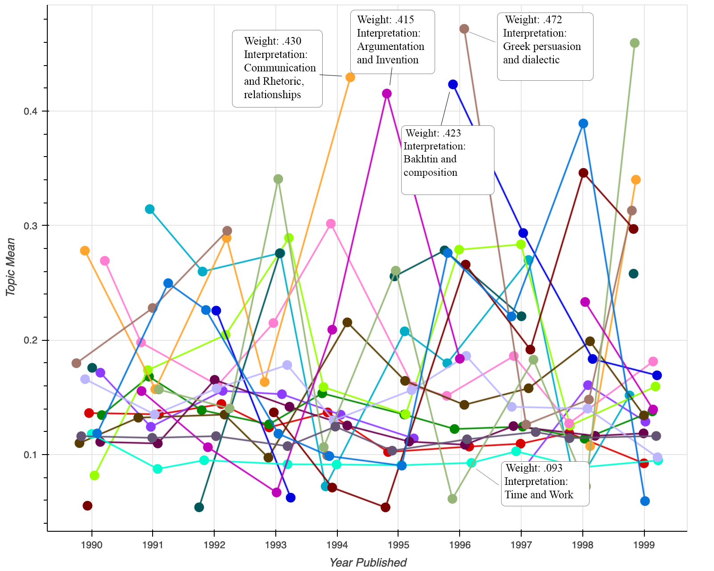

# Tracing _Techne_: Topic Modeling, Data Visualization, and Seeking Impressions
## Kairos Article Draft
In this webtext I trace the rhetorical concept of _techne_ alongside mentions of invention through a corpus of rhetoric and composition field scholarship of the 1990s utilizing the digital humanities methods of topic modeling and data visualization. I undertook this project to explore intersections of creativity, invention, and text-technologies that emerged out of the 1990s and played a key role in recent approaches to digital rhetoric, multimodal composing, and circulation.

<figure>

<figcaption>Annotated line graph that showing impressions of <i>techne</i> by year</figcaption>
</figure>

Underlying this project is an attention to data feminism and feminist rhetorical historiography. As a historiography this project traces impressions of _techne_ in 1990s scholarship in order to recovery its history for rhetorical study. This project assumes that there are rhetorical actions that can be recovered through the uses of data, and that data can be used as a valuable historiographic intervention. This project also assumes that any recovery is a partial perspective. There is a careful feminist attention to power, language, and data within this project that aims to interrogate power within the scholarly record and within the data tools used to trace it. There is a critical attention, in this project to use data science methods with care in order to view differently.

<a href="/michael.healy/introduction/">Next</a>

